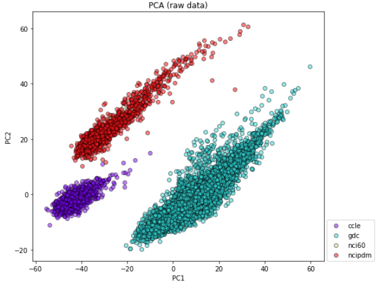

## Batch Effect Removal from RNA-Seq data
This repository contains methods for removing batch-effects from RNA-Seq data. At this point, the ComBat algorithm is the default pre-processing step for most of the downstream analyisis such as drug response prediction and tissue type classification.

The PCA plots below demonstrate the effect of ComBat applied to RNA-Seq profiles. 
The RNA-Seq comes from different sources (i.e., diffrenet studies). PCA of the raw dataset shows that the source carries the strognest component in the combined dataset.
By applying ComBat, the signal of source component is significantly dimished. This often improves predictive algorithm that aim to extract important biological information rather than various sources of bias.

