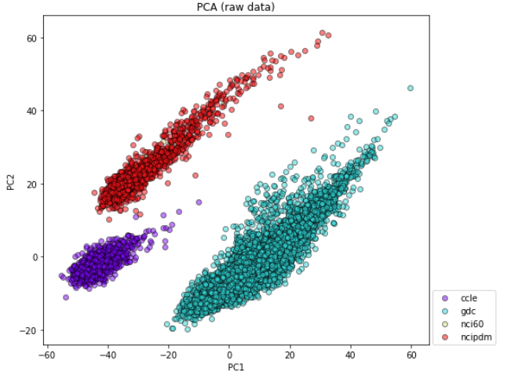
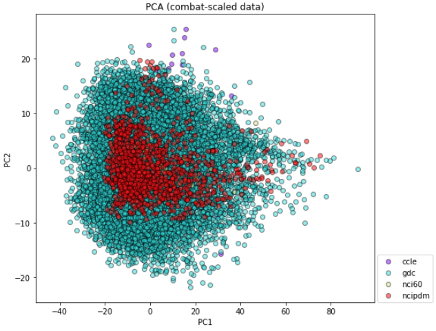

## Batch Effect Removal from RNA-Seq data
This repo contains methods for removing batch-effects from RNA-Seq data.
At this point, the ComBat algorithm is the default pre-processing step for most downstream analyisis such as drug response prediction and tissue type classification.

The PCA plots demonstrate the effect of ComBat method applied to RNA-Seq profiles. 
The RNA-Seq comes from multiple data sources (i.e., drug sensitivity studies).
PCA of raw expression data shows that the source carries the strognest component in the combined dataset.
ComBat normalization significantly suppresses the signal that's coming from source component.
This often improves predictive algorithms that aim to extract important biological information.

## Combat
We adapted the Python implementation of combat from this repo https://github.com/brentp/combat.py. Thanks!
